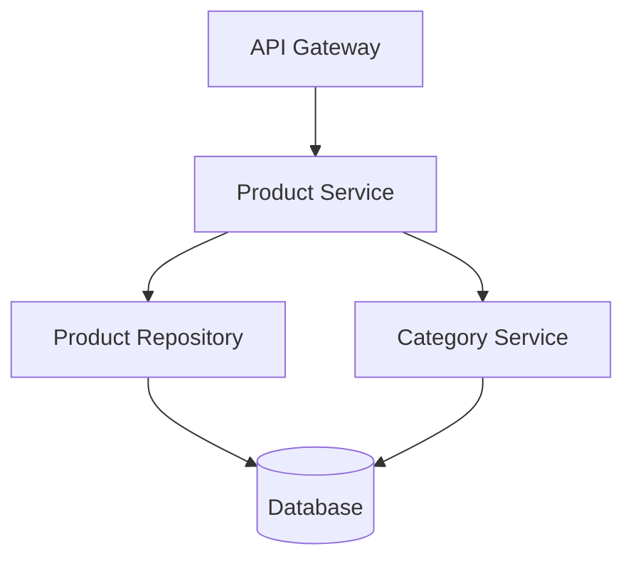

# Example: E-commerce Product API Specification

## Feature Name & Overview

Build a REST API for managing products in an e-commerce platform. Core primitives: Product, Category, Inventory.

## File Structure

```text
src/
├── models/
│   ├── product.py
│   ├── category.py
│   └── inventory.py
├── routes/
│   ├── products.py
│   └── categories.py
└── services/
    └── product_service.py
```

## Data Models

```python
# Product model with validation
class Product(BaseModel):
    id: str
    name: str
    description: Optional[str]
    price: Decimal
    category_id: str
    inventory_count: int
    created_at: datetime
    updated_at: datetime
```

## API Contracts

### GET /api/v1/products

- **Response**: `200 OK`

```json
{
  "products": [
    {
      "id": "prod_123",
      "name": "Wireless Headphones",
      "price": 99.99,
      "category": "Electronics"
    }
  ],
  "pagination": {
    "page": 1,
    "limit": 20,
    "total": 150
  }
}
```

### POST /api/v1/products

- **Request Body**:

```json
{
  "name": "Wireless Headphones",
  "description": "High-quality wireless headphones",
  "price": 99.99,
  "category_id": "cat_456"
}
```

- **Response**: `201 Created` with product data

## Architecture Diagrams



## Dependency Map

| Module | Dependencies | Risk Level |
|--------|-------------|------------|
| Product Service | Category Service, Repository | Medium |
| Category Service | Repository | Low |
| Repository | Database | High |

## Replaceability Assessment

✅ All modules can be rewritten using only their interface contracts
✅ No circular dependencies
✅ Single responsibility principle maintained

## Error & Rescue Map

```text
CODEPATH / METHOD               | WHAT CAN GO WRONG          | EXCEPTION CLASS        | RESCUED? | RESCUE ACTION           | USER SEES             | TESTED?
--------------------------------|----------------------------|------------------------|----------|-------------------------|-----------------------|--------
ProductService.create           | Duplicate SKU              | IntegrityError         | Y        | Return 409              | "SKU already exists"  | Y
ProductService.create           | DB timeout                 | ConnectionTimeoutError | Y        | Retry 1x, then 503     | "Service unavailable" | Y
ProductService.create           | Invalid category_id        | ValidationError        | Y        | Return 422              | Field-level error     | Y
ProductService.get_by_id        | Product not found          | NotFoundError          | Y        | Return 404              | "Product not found"   | Y
CategoryService.list_categories | DB connection lost         | OperationalError       | Y        | Return cached + 200     | Stale but functional  | N <- FIX
```

**Critical Gaps:** None (all errors rescued). `CategoryService.list_categories` cache fallback needs test coverage.


